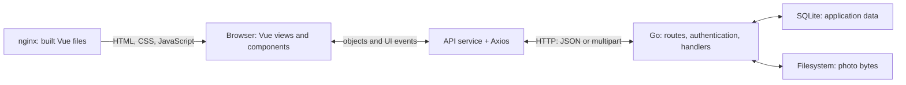

<div align="center">

# 💬 WasaText

**Private chats, group conversations, and photo messages — from a Vue click to a Go API.**


</div>

---

## 🎯 About

WasaText is a **full-stack messaging application** built from the **[Fantastic Coffee (decaffeinated)](https://github.com/sapienzaapps/fantastic-coffee-decaffeinated)** template, for keeping in touch through private and group conversations.

> 🔑 **Project scope:** security is not a goal of this project, so logging in requires only a username, with no password. A new username creates an account; the returned user UUID serves as the bearer token for subsequent requests.

- 👤 **Profiles** — search other users and update your name or avatar.
- 💬 **Conversations** — open a private chat or create a group; add members, change the group name/photo, and leave when you want.
- 📎 **Messages** — send text, photos, or both; reply with a quote, forward to another chat, and delete your own messages.
- 😊 **Reactions** — add, replace, or remove your reaction, with one reaction per user per message.
- ✓ **Activity** — follow read receipts and last-message previews.

---

## 🧩 How It Works

The connection starts with the **API contract** in [doc/api.yaml](doc/api.yaml). It describes operations, request bodies, response schemas, authentication, and errors. The Go handlers implement that contract, and the frontend's [API service](webui/src/services/api.js) exposes functions with the corresponding operation names. These implementations are handwritten; the YAML is not loaded by the server to generate routes at runtime.



**With Docker Compose**, nginx delivers the built Vue files. JavaScript runs in the browser and calls Go directly; nginx is not an API proxy.

Because the frontend and API use different ports, [cors.go](cmd/webapi/cors.go) enables cross-origin requests, including the `Authorization` header and the methods used by the application. Vue Router uses hash URLs such as `/#/chats/<chatId>`; navigation after `#` is handled by Vue and needs no nginx route for each view.

---

## 🗂️ Project Structure

```text
WasaText/
├── doc/
│   ├── api.yaml                     # OpenAPI contract: operations, schemas, errors
│   ├── checklist.md                 # Manual functionality checks for Vue evaluation
│   └── WASA_project.md              # Course requirements and project notes
├── cmd/webapi/                      # Server startup, configuration, CORS, embedding
├── service/
│   ├── api/                         # HTTP routes, authentication, request handlers
│   ├── schemas/                     # Go request/response types and validation
│   ├── database/                    # SQLite tables, queries, transactions, read state
│   ├── photos/                      # Photo files, upload checks, default avatar
│   └── globaltime/                  # Shared clock and timestamp helpers
├── webui/
│   ├── src/
│   │   ├── views/                   # Login, profile, chats, groups
│   │   ├── components/              # Composer, bubbles, quotes, reactions, photos
│   │   ├── services/                # API client, session, caches, formatting
│   │   ├── router/                  # Hash routes and session guards
│   │   └── assets/                  # Application styling
│   ├── public/                      # Static frontend resources
│   ├── package.json / yarn.lock     # Yarn version and frontend dependencies
│   ├── vite.config.js               # Vite setup and API base URL
│   └── static-resources.go          # Optional Go embedding of the built frontend
├── go.mod / go.sum                  # Go dependency versions and checksums
├── db/                              # Optional local data; committed default avatar
├── tests/                           # Endpoint checks, fixtures, lifecycle scenarios
├── Dockerfile.backend               # Go builder → Debian runtime
├── Dockerfile.frontend              # Node/Yarn builder → nginx runtime
├── docker-compose.yml               # Services, ports, and persistent volumes
├── .dockerignore                    # Keep local artifacts/data out of image builds
├── Makefile                         # Complete Docker reset target
└── open-node.sh                     # Interactive Node development container
```

---

## 🚀 Getting Started

### Requirements

| Need | Detail |
| :----- | :----- |
| **Docker + Compose** | Build and run the complete application; Go and Node are supplied by the images. |
| **Browser** | A modern browser to run the Vue interface. |
| **Available ports** | **5173** for the frontend and **3000** for the API. |

### Run it

From the repository root:

```bash
docker compose up --build -d
```

Open `http://localhost:5173`. Sign in with a username to get started. The API is at `http://localhost:3000`.

```bash
docker compose ps
docker compose logs -f backend frontend
curl -i http://localhost:3000/liveness
```

> 💡 **Try both sides:** use two browser profiles or a private window to keep two users signed in separately. Send from one and open the conversation in the other to see the read receipt change.

---

## 🎮 Controls

| Action | Control |
| :----- | :----- |
| Send / new line | `Enter` / `Shift+Enter`. |
| Attach a photo | Click **📎** in the composer. |
| Jump to a quoted message | Click the quote when its target is loaded. |
| Remove your reaction | Click the reaction pill containing your reaction. |

Message bubbles also expose **Reply**, **React**, **Forward**, and **Delete** actions; deletion asks for confirmation.

---

## 🐹 API & Go Backend

[cmd/webapi/main.go](cmd/webapi/main.go) loads configuration, opens SQLite, initializes the tables and photo store, injects them into the API router, applies CORS, and starts the HTTP server. It handles graceful shutdown on interrupt or termination.

[api-handler.go](service/api/api-handler.go) registers the routes below. The Send walkthrough follows one request through its middleware, handler, and database method.

### 📡 API operations

Paths below use OpenAPI's `{parameter}` notation; `httprouter` registers the same parameters using `:parameter`.

| Operation | HTTP request |
| :----- | :----- |
| `doLogin` | `POST /session` |
| `getPhoto` | `GET /photos/{photoId}` |
| `setMyUserName` | `PUT /me/username` |
| `setMyPhoto` | `PUT /me/photo` |
| `getUsers` | `GET /users?username=...` |
| `getUser` | `GET /users/{userId}` |
| `lookupUsers` | `POST /users_lookup` |
| `getMyConversations` | `GET /me/chats` |
| `getConversation` | `GET /chats/{chatId}` |
| `sendMessage` | `POST /chats/{chatId}/messages` |
| `forwardMessage` | `POST /chats/{chatId}/forwards` |
| `deleteMessage` | `DELETE /chats/{chatId}/messages/{messageId}` |
| `commentMessage` | `PUT /chats/{chatId}/messages/{messageId}/comments/me` |
| `uncommentMessage` | `DELETE /chats/{chatId}/messages/{messageId}/comments/me` |
| `createPrivateChat` | `POST /private_chats` |
| `createGroup` | `POST /groups` |
| `getGroup` | `GET /groups/{groupId}` |
| `setGroupName` | `PUT /groups/{groupId}/name` |
| `setGroupPhoto` | `PUT /groups/{groupId}/photo` |
| `addToGroup` | `POST /groups/{groupId}/members` |
| `leaveGroup` | `DELETE /groups/{groupId}/members/me` |

The server also provides public `GET /liveness`. All application routes except login require `Authorization: Bearer <userId>`. Handler errors use `{"code":400,"message":"..."}` with the appropriate HTTP status. Router-level unmatched paths or unsupported methods can return plain text. User search and the conversation list return `404` for no results, which the Vue API service converts into empty arrays.

### 🗄️ Data and application rules

SQLite stores five main tables: `users`, `chats`, `chat_members`, `messages`, and `comments`. Memberships connect users to chats and hold `lastReadDate`. A unique pair key ensures two users share one private chat. Groups own a name and photo; every member can manage them, and the last member leaving deletes the group. Messages belong to a chat and sender; reactions belong to a message and user.

The connection setup enables foreign keys on every connection and immediate transaction locking. Multi-step operations use transactions so their checks and writes succeed or roll back together. Deleting a message cascades to its reactions and clears references from replies without deleting those replies. Forwarding creates a new message with a new ID, the caller as sender, and a persistent `forwarded` flag; it copies content without copying the source's reactions or reply relationship.

Photo bytes live in files, while SQLite stores photo IDs. Uploads accept detected PNG, JPEG, GIF, and WebP content, up to 30 MiB per photo. The store writes a temporary file and renames it after completion. Replaced/deleted photos are collected when no database reference remains; forwarded content can share a photo, and the default avatar is retained. Any authenticated user can fetch a known photo ID under the project's access model.

User search returns at most 20 matches. Shared limits include 5,000 characters per message, 100 group members, and 10,000 stored messages per chat. A conversation response contains the newest 500 messages; the conversation list returns up to 500 chats. The current API/UI has no cursor or offset flow for loading older pages. Character validation uses grapheme clusters, so combined emoji count as a single displayed character where supported by the frontend's `Intl.Segmenter`.

---

## 💚 Vue Frontend

Views own page state and compose reusable components, with Bootstrap resources for styling and `emoji-picker-element` for reactions. Vite builds the app; Axios handles HTTP.

[session.js](webui/src/services/session.js) keeps the current user reactive and persists their ID, username, and photo in browser local storage. Router guards require a session for protected pages. An Axios response interceptor clears an invalid session on `401` and redirects to login.

[ConversationView.vue](webui/src/views/ConversationView.vue) reverses the API's newest-first array for display and preserves the scroll position when the reader is looking further up. Refreshes use the configured polling interval, skip hidden pages, and resume when the page becomes visible.

Profiles are resolved through the user service, including batch lookups. [AuthPhoto.vue](webui/src/components/AuthPhoto.vue) uses [photos.js](webui/src/services/photos.js) to fetch protected images with Axios and create cached blob URLs: a normal image request would not include the bearer header. Group join/leave notices are inferred and saved by the frontend, rather than stored as server-side message events.

---

## 📨 Example: From Click to Message

Alice has signed in, opened her private chat with Bob, and typed **Hi Bob!**. She clicks **Send**. Here is the complete trip through the application and back to the screen, assuming Bob has not read the new message yet.

### 🖱️ Step 1 — The click becomes a Vue event

In [MessageComposer.vue](webui/src/components/MessageComposer.vue), the Send button submits the form. `@submit.prevent="submit"` prevents browser navigation and calls `submit()`.

`canSend` checks that sending is enabled, the text is within the limit, and there is nonblank text or a file. `submit()` emits `send` with `{ text: 'Hi Bob!', file: null, replyTo: null }`. It trims the text but does not clear the draft yet.

### 🧩 Step 2 — The parent starts the operation

[ConversationView.vue](webui/src/views/ConversationView.vue) connects the composer with `@send="onSend"`. `onSend()` sets `sending = true`, clears the previous action error, obtains `chatId` from the route, and awaits `sendMessage(this.chatId, payload)`. The button shows `Sending…` while the request is pending.

### 📡 Step 3 — The API client constructs the HTTP request

[api.js](webui/src/services/api.js) creates `FormData`, appending the nonempty `text` field and, when present, `photoFile` and `replyTo`. Even a text-only message uses multipart form data. Axios posts to `/chats/<chatId>/messages` with a 120-second client timeout; the browser supplies the multipart boundary.

[axios.js](webui/src/services/axios.js) prefixes the configured API URL and attaches Alice's ID as the bearer token. An equivalent request, with `ALICE_ID` and `CHAT_ID` set to real IDs, is:

```bash
curl -i "http://localhost:3000/chats/$CHAT_ID/messages" \
  -H "Authorization: Bearer $ALICE_ID" \
  -F 'text=Hi Bob!'
```

With Compose running, host port 3000 forwards the request to the Go container. CORS middleware handles a browser preflight when required.

### 🔑 Step 4 — Go routes and authenticates the request

[api-handler.go](service/api/api-handler.go) registers:

```go
rt.router.POST("/chats/:chatId/messages", rt.wrap(rt.authenticate(rt.sendMessage)))
```

`wrap` creates the request context/logger. [authenticate](service/api/api-authenticate.go) validates the bearer UUID, verifies that its user exists, and stores Alice's ID in the request context. The sender is taken from that context, not from a client-supplied sender field.

### 📎 Step 5 — The handler validates content and saves an optional photo

[service/api/send-message.go](service/api/send-message.go) validates the chat ID, parses the bounded multipart body, normalizes and validates text through `MessageTextRequest`, validates an optional `replyTo`, and requires text or a photo.

For this text-only example there is no file write. With an attachment, `rt.photos.Save()` applies the photo-store checks and returns the completed file's ID. The handler then calls:

```go
rt.db.SendMessage(userId, chatId, text, photoId, replyTo)
```

### 🗄️ Step 6 — The database commits the message

[service/database/send-message.go](service/database/send-message.go) starts a transaction and checks that the chat exists, Alice is a member, the chat is below its message cap, and any replied-to message belongs to this chat. It generates a UUID and a UTC timestamp with millisecond precision, then inserts the message into `messages`.

The transaction also advances Alice's `chat_members.lastReadDate` to the message time without moving it backwards. [message-state.go](service/database/message-state.go) computes whether every current member has read through that time. Since Bob has not, the message is `received`. After committing, the method returns the complete message with an empty reactions array.

> 📎 **With an attachment:** photo storage and SQL are separate operations: if the database step fails after an upload, the handler attempts to delete that newly uploaded file and logs a cleanup failure if necessary.

### ↩️ Step 7 — The response travels back to the UI

The handler converts any photo ID to a relative `/photos/<photoId>` URL and returns `201 Created`. A representative response for this example is:

```json
{
  "id": "33333333-3333-4333-8333-333333333333",
  "user": "11111111-1111-4111-8111-111111111111",
  "date": "2026-09-16T10:00:00.123Z",
  "state": "received",
  "content": { "text": "Hi Bob!" },
  "comments": []
}
```

These IDs and the timestamp are illustrative. `photo`, `replyTo`, and `forwarded` are omitted when absent/false.

Axios resolves the request, and the API service returns `res.data`. `onSend()` calls `upsertMessage()` to insert the returned message into the reactive array, resolves the sender profile, resets the composer, clears the reply selection, and scrolls down after Vue updates the DOM. [MessageBubble.vue](webui/src/components/MessageBubble.vue) renders the content, time, and single checkmark. The sender sees the successful message immediately from the POST response, without waiting for polling.

> ⚠️ **If sending fails:** `errorMessage()` supplies the displayed error and the draft remains available. Examples include `400` for invalid content or a full chat, `401` for invalid authentication, `403` for a nonmember, and `404` for a missing chat or reply target.

### ✓ Step 8 — Bob reads it, and Alice sees the second checkmark

Bob's visible conversation view calls `getConversation()` on opening and during polling. [service/database/get-conversation.go](service/database/get-conversation.go) retrieves the newest messages and advances Bob's read timestamp in the same transaction. The message states in that particular response are computed before the timestamp update.

On Alice's subsequent chat fetch, the database sees that both members have caught up and returns `state: "read"`. `MessageBubble.vue` renders `✓✓`. In a group, every current member must have caught up. Read state is calculated from membership timestamps, not stored as a boolean on each message, and it represents fetching the conversation rather than tracking which bubble was visible on screen.

---

## 🐳 Docker & Storage

The Dockerfiles compile the Go API and build Vue, then package them in small runtime images; nginx serves the frontend. [Compose](docker-compose.yml) and the [Makefile](Makefile) make frequent tasks easy: run both services together, stop them with `docker compose down`, or perform a clean rebuild with `make docker-reset`.

Database and photo volumes survive normal stops and rebuilds, independently of the repository's `db/` folder.

> ⚠️ `make docker-reset` and `docker compose down --volumes` erase the stored database and photos.

---

## 🛠️ Development & Builds

For local development and the test scripts, start Go from the repository root with a C compiler available:

```bash
CFG_DB_FILENAME=./db/WasaText.db \
CFG_PHOTOS_DIRECTORY=./db/photos \
CGO_ENABLED=1 go run ./cmd/webapi/
```

In another terminal, run Vue in Node 20 to match the project's Linux dependency configuration:

```bash
docker run --rm -it -p 5173:5173 -v "$PWD:/src" -w /src/webui \
  node:20 bash -lc 'corepack enable && yarn install --immutable && yarn run dev --host 0.0.0.0'
```

Open `http://localhost:5173`. Stop the corresponding Compose services first to free ports 3000 and 5173.

From `webui/` in the Node/Yarn environment, use `yarn run build-prod` for a production bundle and `yarn run preview` to serve it. For an embedded app, run `yarn run build-embed`, then build Go from the root with `go build -tags webui -o webapi ./cmd/webapi/`; running `./webapi` serves the UI at `/dashboard/`.

Go dependencies are downloaded automatically from `go.mod` and `go.sum`; keep both files committed. The backend Docker build downloads modules in a separate layer, reused until either file changes. Local Go builds use the Go module cache outside the repository; `vendor/` is not required and is ignored.

Use Corepack to download and run the Yarn version pinned by `packageManager` in `webui/package.json`; the repository does not bundle Yarn. The Docker image sets up Corepack automatically. For local development, install Corepack if your Node installation does not include it, run `corepack enable`, then run `yarn install --immutable` from `webui/` once before using the frontend scripts. Keep `yarn.lock` committed; npm's `package-lock.json` is not used. Frontend scripts can download missing cached dependencies while keeping `yarn.lock` unchanged.

---

<a id="configuration"></a>

## ⚙️ Configuration

[Backend settings](cmd/webapi/load-configuration.go) accept `CFG_` environment variables, flags, and an optional YAML file, in that override order. Defaults use port **3000**, `/tmp/WasaText.db`, and `/tmp/WasaText-photos`; `go run ./cmd/webapi/ --help` lists the options.

[vite.config.js](webui/vite.config.js) compiles `http://localhost:3000` into the frontend as `__API_URL__`. Changing it requires rebuilding; `localhost` refers to the browser's computer. The refresh interval is **3 seconds**, set by `POLL_MS` in [axios.js](webui/src/services/axios.js).

---

## 🧪 Validation & Tests

[tests/endpoints.md](tests/endpoints.md) documents endpoint cases and multi-operation scenarios. [tests/run-tests.sh](tests/run-tests.sh) exercises authentication, validation, permissions, responses, and database/photo effects. [tests/run-scenarios.sh](tests/run-scenarios.sh) covers sequences such as renaming, membership changes, message lifecycle, and shared-photo retention.

> ⚠️ **Disposable data only:** `run-tests.sh` calls `seed.sh`, which erases local database rows and uploaded photos before creating fixtures. The scenario suite also modifies data. The scripts currently hard-code `/Users/lorenzo/WasaText`, `localhost:3000`, and `db/WasaText.db`; adjust the repository path when using another checkout. They require Bash, curl, and the `sqlite3` CLI, and must target a local Go server configured with the repository data paths above, rather than the Compose database volume.

With that disposable server already running:

```bash
bash tests/run-tests.sh
bash tests/run-scenarios.sh
```

The project includes [.spectral.js](.spectral.js), [.golangci.yml](.golangci.yml), and [webui/eslint.config.mjs](webui/eslint.config.mjs) for API, Go, and frontend checks. [validator.md](validator.md) records the validator setup. Once the tools and frontend dependencies are installed:

```bash
lint-openapi doc/api.yaml
golangci-lint run
```

Run `yarn run lint` from `webui/` for the frontend. The Go lint configuration targets Go 1.25.

---

## 👥 Authors
WasaText was designed and built by:
- **[LM-official](https://github.com/LM-official)**
- **[Enrico204](https://github.com/Enrico204)**

---

## 📄 License
Released under the MIT License. See [LICENSE](LICENSE).
