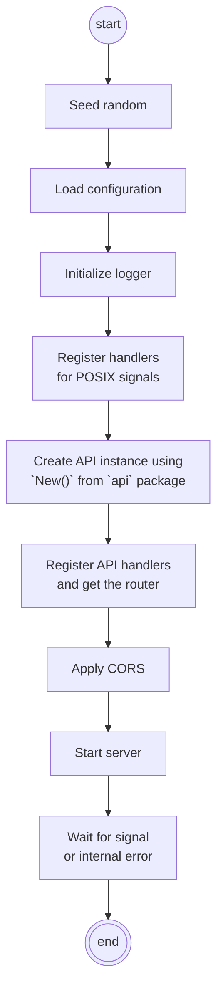

# WASA — WASAText API Design & Project Structure

## Useful Links
1. Home: <https://gamificationlab.uniroma1.it/courses/wasa>
   1. Results: <https://wasa-enroll.sapienzaapps.it/dashboard/#/>
2. Template: <https://github.com/sapienzaapps/fantastic-coffee-decaffeinated/>
3. Tools:
   1. YAML: <https://editor.swagger.io>
   2. GO: <https://go.dev/play>

---

# Part 1 — HW1: WASAText API Design

## WASAText: Riassunto Funzionale
WASAText è una piattaforma di messaggistica che supporta chat individuali e di gruppo, accessibile tramite PC.

## Interfaccia Utente e Gestione Conversazioni
- **Lista Conversazioni:** Le conversazioni sono presentate in ordine cronologico inverso.
- **Dettagli Lista:** Ogni elemento mostra: username/nome del gruppo, foto profilo, data/ora dell'ultimo messaggio, e un'anteprima (snippet) del messaggio (testo o icona per foto).
- **Nuova Chat:** L'utente può avviare nuove conversazioni individuali con qualsiasi altro utente WASAText.
- **Ricerca:** Possibilità di cercare altri utenti tramite username.

## Gruppi
- **Creazione:** Gli utenti possono creare nuovi gruppi con qualsiasi numero di altri utenti WASAText.
- **Membri:** Solo i membri esistenti possono aggiungere altri utenti. Gli utenti non possono unirsi da soli o vedere gruppi di cui non fanno parte.
- **Abbandono:** I membri possono lasciare un gruppo in qualsiasi momento.

## Messaggi e Interazioni
- **Visualizzazione Chat:** I messaggi sono visualizzati in ordine cronologico inverso all'interno di una conversazione.
- **Contenuto Messaggio:** Include timestamp, contenuto (testo o foto) e username del mittente per i messaggi ricevuti.
- **Funzionalità di Messaggistica:** L'utente può inviare un nuovo messaggio, rispondere a uno esistente, inoltrare un messaggio ed eliminare i propri messaggi inviati.

## Stato del Messaggio (Checkmarks)
Il sistema utilizza dei segni di spunta per indicare lo stato di consegna e lettura dei messaggi inviati:
| Segni di Spunta | Stato | Destinatari |
|---|---|---|
| Uno (1) | Messaggio ricevuto. | Tutti i destinatari lo hanno nella loro lista di conversazione. |
| Due (2) | Messaggio letto. | Tutti i destinatari lo hanno visualizzato all'interno della conversazione. |

## Reazioni e Profili
- **Reazioni:** Gli utenti possono reagire ai messaggi (commentarli) con un emoticon. Le reazioni e i nomi degli utenti che le hanno postate sono visualizzati. Le reazioni possono essere eliminate (uncomment).
- **Autenticazione:** Il login avviene semplicemente inserendo l'username (vedi Sezione "Simplified Login").
- **Gestione Profilo:** L'utente può aggiornare il proprio nome, purché il nuovo nome non sia già in uso.

## HW1
Il primo homework è limitato al design dell'API.
Non include implementazione di codice.
Lo strumento richiesto è OpenAPI Specification (YAML).

## OpenAPI
Bisogna definire almeno questi `operationId`:
- `doLogin`
- `setMyUserName`
- `getMyConversations`
- `getConversation`
- `sendMessage`
- `forwardMessage`
- `commentMessage`
- `uncommentMessage`
- `deleteMessage`
- `addToGroup`
- `leaveGroup`
- `setGroupName`
- `setMyPhoto`
- `setGroupPhoto`

## Cosa Dovete Fare
1. Consultare la specifica completa del progetto:
   - Progetto: **WASAText.pdf** (link: http://gamificationlab.uniroma1.it/notes/WASAText.pdf).
2. Mantenere la struttura del template Git:
   - Repository: https://github.com/sapienzaapps/fantastic-coffee-decaffeinated/.
3. Modificare il file della specifica API:
   - File target: `doc/api.yaml` nel repository.
4. Scrivere l'intera specifica OpenAPI 3.x.
   - Definire **Risorse, Path, Metodi HTTP, Richieste, Risposte, Schemi**.

## Struttura e Requisiti Tecnici

### Template del Progetto
Il lavoro va svolto all'interno del repository fornito.
- **Repository:** `fantastic-coffee-decaffeinated`.
- **File da Modificare:** `doc/api.yaml`.

### Contenuto di api.yaml
Il file `api.yaml` deve contenere la definizione RESTful completa per il progetto:
- Blocco `info` (titolo, descrizione, versione).
- Blocco `paths` (tutti gli endpoint REST).
- Blocco `components/schemas` (tutti i modelli di dati riutilizzabili).
- Uso corretto dei verbi HTTP (`GET`, `POST`, `PUT`, `DELETE`).
- Definizione di Body di richiesta e Risposte HTTP (es. `200`, `201`, `404`).

## Consegna e Valutazione

### Prima di Iniziare (Enrollment)
- L'iscrizione per l'Homework è obbligatoria.
- Link Enrollment: https://wasa-enroll.sapienzaapps.it/dashboard/#/enroll.

### 1. Requisiti del Repository Git
- **Creazione:** Dovete creare un singolo repository Git su una "git forge" (GitHub, GitLab, BitBucket, ecc.) che sarà utilizzato per tutti gli homework.
- **Visibilità:** Il repository deve essere **privato**.
- **Accesso:** Per permettere al sistema di valutazione di accedere ai file, dovete aggiungere una **chiave SSH** come "**Deploy Key**" con permessi di sola lettura.
- **Ottenere la Chiave:** Compilate il modulo su https://wasa-enroll.sapienzaapps.it/dashboard/ per ottenere la chiave SSH da inserire.
- **Aggiunta della Chiave:**
  - **GitLab:** `Settings -> Repository -> Deploy keys -> Add Key`.
  - **GitHub:** `Settings -> Deploy keys -> Add Key`.
- **Valutazione:** Verrà scaricato periodicamente il branch di default (solitamente `master` o `main`). Verrà valutata l'ultima versione del repository ad ogni download di nuovi commit.

### Istruzioni di Consegna
- La consegna avviene tramite il sistema automatico.
- **Istruzioni Dettagliate:** http://gamificationlab.uniroma1.it/en/wasa/homeworks_delivery/.

### Calendario delle Valutazioni
Le valutazioni sono automatiche.
- **Valutazione Standard:** Ogni Mercoledì, tutto l'anno.
- **Periodi Esclusi:** Festività, domeniche, periodi accademici di vacanza, Agosto.
- **Pre-Appello:** Valutazione giornaliera (Mercoledì-Martedì) prima dell'appello d'esame.
- **Tempistiche:** Le valutazioni iniziano in tarda mattinata. I risultati sono pubblicati nel tardo pomeriggio.

### Risultati e Supporto
- **Pubblicazione Risultati:** https://wasa-enroll.sapienzaapps.it/dashboard/#/.
- **Domande Frequenti (FAQ):** http://gamificationlab.uniroma1.it/en/wasa/faq/.

### Riepilogo Passi
| Azione | Link/Dettaglio |
|---|---|
| Leggi le specifiche complete del progetto. | `WASAText.pdf` |
| Iscriviti per l'assegnazione. | https://wasa-enroll.sapienzaapps.it/dashboard/#/enroll |
| Ottieni il template di base. | https://github.com/sapienzaapps/fantastic-coffee-decaffeinated/ |
| Modifica *solo* `doc/api.yaml` con la specifica OpenAPI. | `doc/api.yaml` |
| Segui le istruzioni esatte. | http://gamificationlab.uniroma1.it/en/wasa/homeworks_delivery/ |
| Verifica i risultati ogni Mercoledì. | https://wasa-enroll.sapienzaapps.it/dashboard/#/ |

## Nota: Login Semplificato e Autenticazione (WASAText)

### La Logica del Login Semplificato
Il progetto WASAText adotta una procedura di login semplificata per evitare la complessità e i problemi di sicurezza associati all'implementazione di flussi standard (registrazione, password, recupero account). Questi compiti, nei progetti reali, sono delegati a servizi esterni detti **Identity Provider (IdP)**.
Nel contesto di questo progetto, l'IdP è omesso, e il login opera così:
- **Endpoint:** L'API fornisce un endpoint di login predefinito (specificato nel documento OpenAPI fornito a parte).
- **Credenziali:** L'endpoint accetta solo lo username (es. "Maria"), senza alcuna password.
- **Funzionamento:**
  - Se lo username esiste, l'utente viene loggato.
  - Se lo username è nuovo, l'utente viene registrato e subito loggato.

### Meccanismo di Autenticazione
Dopo il login, l'API restituisce un **identificatore utente**. Questo ID deve essere utilizzato per tutte le richieste API successive al fine di autenticare l'utente.
- **Metodo:** Viene utilizzato il principio del **Bearer Authentication**.
- **Header:** L'identificatore utente (non un token JWT reale, ma l'ID fornito) deve essere incluso nell'header `Authorization` di ogni richiesta.
  - *Esempio Concettuale:* `Authorization: Bearer [Identificatore Utente]`
- **Assenza di Sessioni:** Non è richiesto l'uso di sessioni HTTP o cookie di sessione.

### Nota sulla Sicurezza (Contesto Progetto)
- **Scope:** La sicurezza relativa all'autenticazione (impedire a un utente di usare lo username di un altro) è **ignorata** nel progetto.
- **Focus:** L'obiettivo è concentrarsi sul design dell'API e sull'integrazione di base, non sulla risoluzione dei problemi di sicurezza che sarebbero normalmente gestiti da un servizio Identity Provider dedicato.

---

# Part 2 — Go Project Structure (Best Practices)

## "Best practice"
> A working method, or set of working methods, that is officially accepted as being the best to use in a particular business or industry […]
*Definition of "best practice" from the Cambridge Business English Dictionary © Cambridge University Press*

## What?
"Fantastic Coffee (decaffeinated)" is an opinionated template we made.
It combines some best practices about Go.
- <https://gitlab.com/sapienzaapps/fantastic-coffee-decaffeinated>
- <https://github.com/sapienzaapps/fantastic-coffee-decaffeinated>

## Fantastic Coffee (decaf) structure
```text
cmd/
demo/
doc/
go.mod
go.sum
LICENSE
open-npm.sh
README.md
service/
vendor/
webui/
```

## `cmd/`
`cmd/` contains executables.
Go code here should only present packages in a usable manner. E.g.:
1. Read CLI options
2. Import packages and use functions to register API handlers
3. Start web server
4. Wait for termination signal

## `service/`
All packages should be here, as sub-directories. Nesting is possible.
E.g., `services/globaltime/` is the `globaltime` package.

## `vendor/`
It contains the source for all external packages ("dependencies").
You should update it when you add/update/remove dependencies:
```sh
go mod vendor
```
See <https://go.dev/ref/mod#vendoring>.

## `webui/`
Contains a Vue.js project. We'll see the content in few weeks.

## `cmd/webapi/`
```text
cmd/webapi/cors.go
cmd/webapi/load-configuration.go
cmd/webapi/main.go
cmd/webapi/register-web-ui.go
cmd/webapi/register-web-ui-stub.go
```

## `cmd/webapi/main.go`


## HTTP request wrappers
```text
┌───────────────────────────────────────────────────────────────────┐
│ net/http: Read HTTP request and spawn goroutine                   │
│ ┌───────────────────────────────────────────────────────────────┐ │
│ │ cmd/webapi/cors.go: apply CORS                                │ │
│ │ ┌───────────────────────────────────────────────────────────┐ │ │
│ │ │ cmd/webapi/register-web-ui.go: is Web UI?                 │ │ │
│ │ │ ┌───────────────────────────────────────────────────────┐ │ │ │
│ │ │ │ github.com/julienschmidt/httprouter.Router.ServeHTTP()│ │ │ │
│ │ │ │ ┌───────────────────────────────────────────────────┐ │ │ │ │
│ │ │ │ │ service/api/api-context-wrapper.go:               │ │ │ │ │
│ │ │ │ │ generate UUID, logger                             │ │ │ │ │
│ │ │ │ │            ┌───────────────────┐                  │ │ │ │ │
│ │ │ │ │            │  real API handler │                  │ │ │ │ │
│ │ │ │ │            └───────────────────┘                  │ │ │ │ │
│ │ │ │ └───────────────────────────────────────────────────┘ │ │ │ │
│ │ │ └───────────────────────────────────────────────────────┘ │ │ │
│ │ └───────────────────────────────────────────────────────────┘ │ │
│ └───────────────────────────────────────────────────────────────┘ │
└───────────────────────────────────────────────────────────────────┘
```

---

# Part 3 — Vue.js:

## 1. Framework
- Framework = libreria + *inversione di controllo* (chiama lui il tuo codice, non viceversa); estensibile ma non modificabile dall'utente.
- Libreria → la integri tu. Framework → integri il tuo codice in esso.
- Esempi: React, Angular, Vue.js, Ember.js, GWT. TypeScript: superset sintattico di JS, non usato nel corso ma utile da conoscere.

## 2. Pattern MVVM
| Livello | Ruolo | In Vue |
|---|---|---|
| View | presentazione passiva, intercetta interazioni | `<template>` |
| ViewModel | databinding, dati "pronti" + comandi utente | `<script>` |
| Model | logica di business, dati grezzi | dati/API esterne |

## 3. Vue.js
- Framework **progressivo**, adottabile incrementalmente; alternativa a jQuery o motore per SPA.
- Modalità d'uso: Standalone, Embedded, SPA, Full-stack/SSR (Nuxt), SSG.
- Core: **rendering dichiarativo** (template + stato JS) e **reattività** (auto-update DOM).
- **Options API** (oggetto con `data`/`methods`/`mounted`, usata nel corso) vs **Composition API** (funzioni, più flessibile).
```js
createApp({ data() { return { count: 0 } } }).mount('#app')
```
- Playground ufficiale: https://sfc.vuejs.org/

## 4. Struttura progetto
- **SFC** (`.vue`): `<template>` (HTML) + `<script>` (logica) + `<style scoped>` (CSS solo locale).
- `index.html`: entry point, carica `main.js` come module.
- `main.js`: crea l'app, applica il router, monta su `#app`.
- `App.vue`: componente principale (contiene `<RouterView>`).
- Setup progetto: `npm create vue@latest` (Vite).

## 5. Sintassi template
- Interpolazione `{{ msg }}`, auto-escaped (sicura da XSS).
- Espressioni JS **singole** ok (`{{ a+1 }}`, ternari, chiamate a funzioni); **NO** statement/controllo di flusso.
- Direttive `v-*`: `v-text` (safe) · `v-html` (⚠️ unsafe) · `v-show` (toggle visibilità, resta nel DOM) · `v-if/else` (toggle rendering) · `v-for` (ripetizione) · `v-on`/`@` (eventi) · `v-bind`/`:` (attributo dinamico) · `v-model` (binding bidirezionale, solo su input/select/textarea/componenti Vue).

## 6. Stato reattivo
- Stato dichiarato in `data()`: tutte le variabili vanno elencate lì (anche a `null`/`undefined`); niente prefissi `$`/`_`; **deep-reactive**; i dati sono proxy (non "puri", quindi `===` può fallire dopo assegnazione).
- Accesso: `this.x` in JS, `x` nel template (senza `this`).
- Aggiornamenti DOM **bufferizzati** (non sincroni) → `nextTick()` per leggere il DOM appena aggiornato.

## 7. Computed
- Getter con **caching** (lazy): ricalcola solo se cambia una dipendenza; può avere get/set.
- Vs `methods`: computed per **comporre valori** (cache), methods per **azioni** (rieseguiti sempre).

## 8. Watchers
- Oggetto `watch`: chiave = nome proprietà `data`, callback `(newVal, oldVal)` per side-effect (es. fetch asincrone).

## 9. Methods
- Logica/azioni, richiamabili da JS o template; **niente arrow function** (perderebbero `this`).

## 10. Lifecycle
`beforeCreate → created → beforeMount → mounted → (update) beforeUpdate → updated → (unmount) beforeUnmount → unmounted`
- `created()`: dati pronti, no DOM → init dati.
- `mounted()`: DOM pronto → **fetch dati iniziali da API** (es. backend Go).
- `beforeUnmount()`: pulizia listener/timer.

## 11. Vue Router
- SPA: viste renderizzate sul client; server fornisce JS/HTML/CSS + API; stato consistente tra pagine senza cookie manuali.
- Routes (path ↔ componente), `<RouterView>` (punto di rendering), `<RouterLink to="...">` (link).
- History: **push** (nuova vista) · **go** (avanti/indietro) · **replace** (sostituisce).
- Config in `router/index.js` con `createRouter` + `createWebHashHistory` (URL tipo `#/link1`); in `main.js`: `app.use(router)`.
- Navigazione da JS: `this.$router.push('/')`.
- Parametri rotta (`/some/:id/link`): `this.$route.params.id`. ⚠️ Cambiare solo il parametro sulla stessa rotta **non ricarica** il componente → serve `this.$watch(() => this.$route.params, ...)`.

## 12. JS asincrono
- **Promise**: valore futuro, stati pending/fulfilled/rejected; `.then()/.catch()`.
- **async/await**: zucchero sintattico, funzione `async`, `await` sincronizza l'attesa; errori con try/catch.

## 13. Chiamate HTTP: AJAX, XHR, Fetch, Axios
**AJAX** (Asynchronous JavaScript and XML): insieme di tecnologie (HTML/CSS, JS, DOM, XML/XSLT, XMLHttpRequest) per aggiornamenti incrementali di una pagina.
**XMLHttpRequest (XHR)**: oggetto nativo per eseguire richieste web (nonostante il nome, usabile anche per dati non-XML); supportato da tutti i browser (anche IE, tramite ActiveX). **Scartato per il progetto**: troppo verboso, interfaccia datata (niente supporto nativo per `async`/`await`).
**Fetch API**: alternativa più moderna a XHR, ma ancora "work in progress" — mancano timeout nativo, gestione del progresso upload/download, buona backward compatibility. **Scartata anch'essa**.
**Axios** — quello che useremo: client HTTP per browser/Node.js basato su **Promise**. Caratteristiche principali:
- esegue XHR dietro le quinte, direttamente dal browser;
- pienamente basato su Promise (ottimo con async/await);
- **interceptor** di richiesta/risposta per logiche personalizzate (es. header di auth, log);
- trasformazione automatica dei dati di richiesta/risposta;
- **annullamento richieste** (integrazione con `AbortController`);
- gestione automatica del **JSON** (serializza/analizza);
- serializzazione automatica dei **form** (`multipart/form-data`, `x-www-form-urlencoded`);
- protezione **XSRF** lato client.

### Integrazione in Vue (globale via `this.$axios`)
```js
// main.js
import { createApp } from 'vue'
import App from './App.vue'
import axios from 'axios'

let app = createApp(App)
app.config.globalProperties.$axios = axios // ora disponibile come this.$axios ovunque
app.mount('#app')
```

### Esempi d'uso in un componente
```js
// GET
async refresh() {
  try {
    let response = await this.$axios.get("/")
    // response.data → JSON nel body della risposta
  } catch (e) {
    console.error(e.toString())
  }
}

// POST
async sendData() {
  try {
    let response = await this.$axios.post("/some/api", {
      firstName: 'Fred',
      lastName: 'Flintstone',
    })
  } catch (e) {
    console.error(e.toString())
  }
}
```

### Interceptor
```js
axios.interceptors.request.use(function (config) {
  // modifica la config prima dell'invio (es. header di auth)
  return config
}, function (error) {
  return Promise.reject(error)
})

axios.interceptors.response.use(function (response) {
  // gestisci/logga la risposta riuscita
  return response
}, function (error) {
  // gestisci errori (4xx, 5xx)
  return Promise.reject(error)
})
```

### Cancellazione richieste
```js
const controller = new AbortController()

async function fetchWithCancellation() {
  try {
    const response = await this.$axios.get('/user/12345', { signal: controller.signal })
  } catch (e) {
    if (axios.isCancel(e)) {
      console.log('Richiesta annullata', e.message)
    }
  }
}

controller.abort() // annulla la richiesta
```

---

## Punti chiave per il progetto
- Struttura: `main.js` (app + router + axios globale) → `App.vue` (`<RouterView>`) → viste/componenti nelle rotte.
- Dati dal backend Go: `this.$axios` dentro `mounted()` (o in metodi async richiamati da essa).
- `data()` per stato reattivo, `computed` per valori derivati, `watch` per side-effect, `methods` per azioni.
- Routing: `router/index.js` + `<RouterLink>`/`<RouterView>`.
- **Axios** al posto di Fetch/XHR per tutte le chiamate API, sfruttando Promise/async-await e interceptor per logiche comuni (es. header di auth).