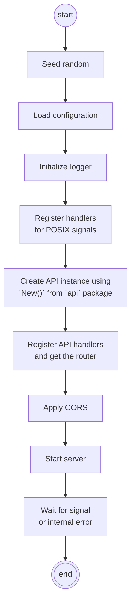

# Go Project Structure (Best Practices)

**WASA** · Enrico Bassetti · Sapienza University of Rome

---

## "Best practice"

> A working method, or set of working methods, that is officially accepted as being the best to use in a particular business or industry […]

*Definition of "best practice" from the Cambridge Business English Dictionary © Cambridge University Press*

---

## What?

"Fantastic Coffee (decaffeinated)" is an opinionated template we made.
It combines some best practices about Go.

- <https://gitlab.com/sapienzaapps/fantastic-coffee-decaffeinated>
- <https://github.com/sapienzaapps/fantastic-coffee-decaffeinated>

---

## Fantastic Coffee (decaf) structure

```text
cmd/
demo/
doc/
go.mod
go.sum
LICENSE
open-npm.sh
README.md
service/
vendor/
webui/
```

---

## `cmd/`

`cmd/` contains executables.

Go code here should only present packages in a usable manner. E.g.:

1. Read CLI options
2. Import packages and use functions to register API handlers
3. Start web server
4. Wait for termination signal

---

## `service/`

All packages should be here, as sub-directories. Nesting is possible.

E.g., `services/globaltime/` is the `globaltime` package.

---

## `vendor/`

It contains the source for all external packages ("dependencies").

You should update it when you add/update/remove dependencies:

```sh
go mod vendor
```

See <https://go.dev/ref/mod#vendoring>.

---

## `webui/`

Contains a Vue.js project. We'll see the content in few weeks.

---

## `cmd/webapi/`

```text
cmd/webapi/cors.go
cmd/webapi/load-configuration.go
cmd/webapi/main.go
cmd/webapi/register-web-ui.go
cmd/webapi/register-web-ui-stub.go
```

---

## `cmd/webapi/main.go`



---

## HTTP request wrappers

```text
┌───────────────────────────────────────────────────────────────────┐
│ net/http: Read HTTP request and spawn goroutine                   │
│ ┌───────────────────────────────────────────────────────────────┐ │
│ │ cmd/webapi/cors.go: apply CORS                                │ │
│ │ ┌───────────────────────────────────────────────────────────┐ │ │
│ │ │ cmd/webapi/register-web-ui.go: is Web UI?                 │ │ │
│ │ │ ┌───────────────────────────────────────────────────────┐ │ │ │
│ │ │ │ github.com/julienschmidt/httprouter.Router.ServeHTTP()│ │ │ │
│ │ │ │ ┌───────────────────────────────────────────────────┐ │ │ │ │
│ │ │ │ │ service/api/api-context-wrapper.go:               │ │ │ │ │
│ │ │ │ │ generate UUID, logger                             │ │ │ │ │
│ │ │ │ │            ┌───────────────────┐                  │ │ │ │ │
│ │ │ │ │            │  real API handler │                  │ │ │ │ │
│ │ │ │ │            └───────────────────┘                  │ │ │ │ │
│ │ │ │ └───────────────────────────────────────────────────┘ │ │ │ │
│ │ │ └───────────────────────────────────────────────────────┘ │ │ │
│ │ └───────────────────────────────────────────────────────────┘ │ │
│ └───────────────────────────────────────────────────────────────┘ │
└───────────────────────────────────────────────────────────────────┘
```